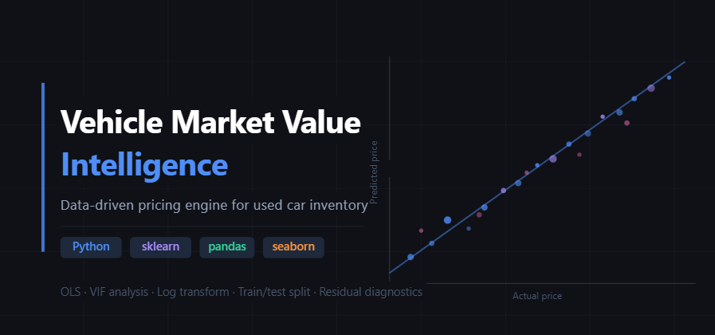
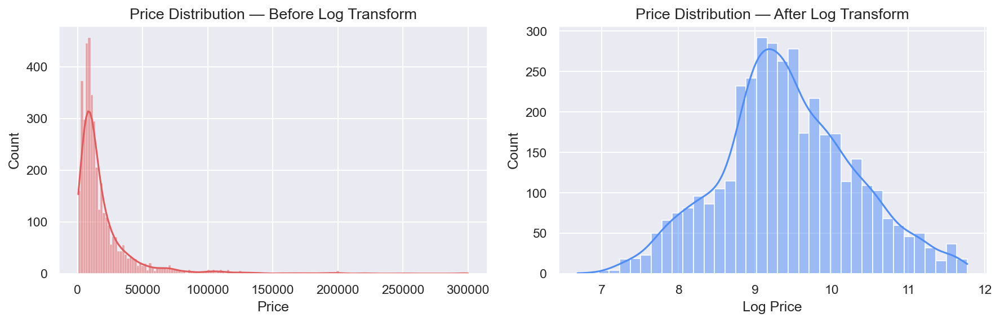
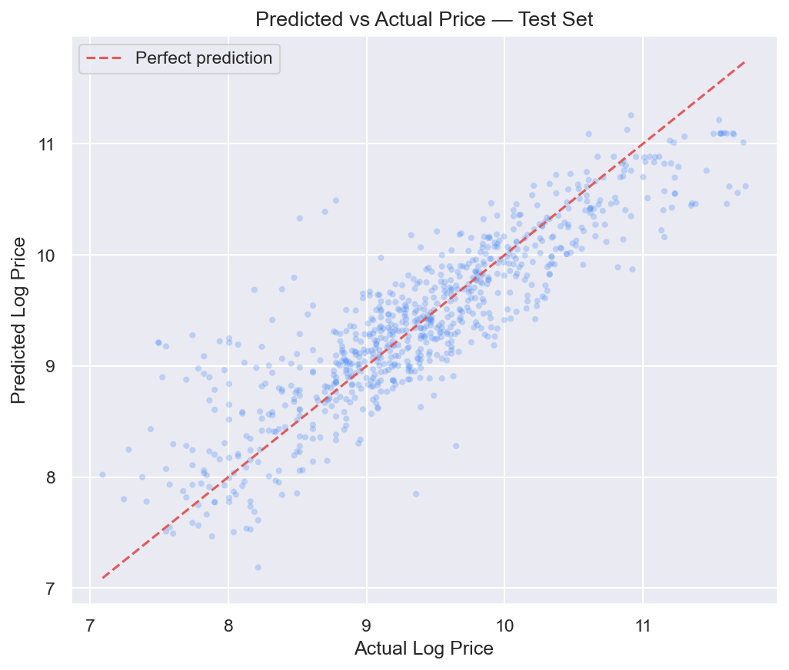
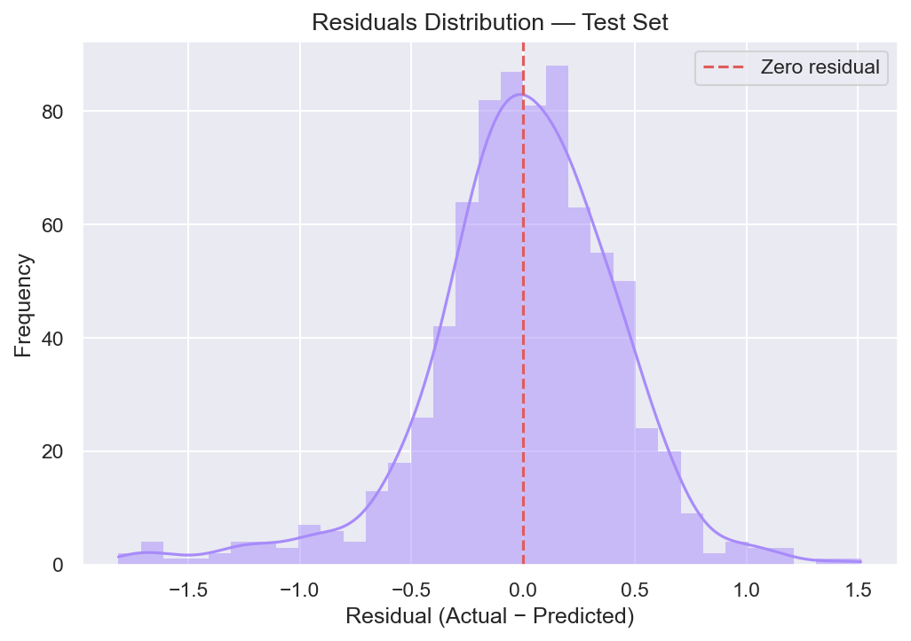
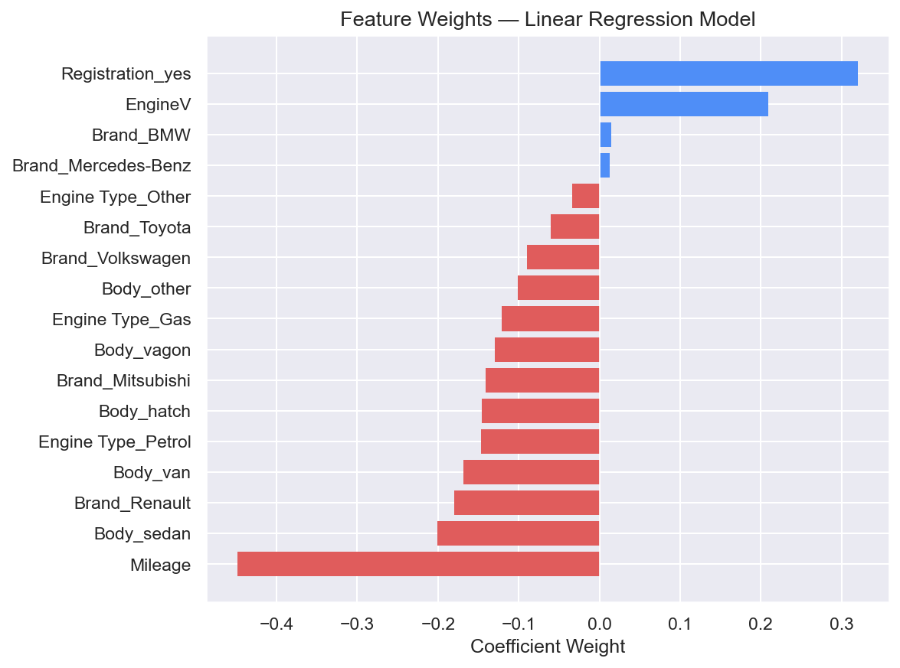

# Vehicle Market Value Intelligence
### Data-driven pricing engine for used car inventory

A statistical modelling project that predicts used car market prices from 
vehicle attributes. The pipeline covers the full analytical workflow — from 
raw data exploration to model evaluation and residual diagnostics — built 
with Python and scikit-learn.

---

## Overview

Pricing used vehicles accurately is a core challenge for automotive 
marketplaces, dealerships, and valuation platforms. This project tackles 
that problem by building an interpretable linear regression model trained 
on 6,000+ real-world listings, engineered to satisfy OLS assumptions and 
optimised for generalisation on unseen data.

---

## Results

| Metric | Value |
|---|---|
| R² — train set | 0.7450 |
| R² — test set | 0.7727 |
| Mean % error | 36.26% |
| Median % error | 23.47% |

The model explains **77.3% of variance** in used car prices on unseen data, 
with a test R² exceeding train R² — indicating strong generalisation and no 
overfitting.

---

## Methodology

### 1. Data cleaning and outlier removal
Raw data contained missing values and extreme outliers across price, mileage, 
engine volume, and year. Outliers were removed using quantile thresholds, 
retaining the natural distribution of each variable.

### 2. OLS assumption checks and log transformation

Price was exponentially distributed, violating the linearity assumption of OLS. 
A log transformation resolved this, producing a near-normal distribution and 
significantly improving model fit.



### 3. Multicollinearity detection

Variance Inflation Factor (VIF) analysis identified `Year` as highly 
collinear with other features. Removing it reduced multicollinearity across 
the remaining variables without sacrificing predictive performance.

### 4. Feature engineering

Categorical variables (Brand, Body, Fuel Type, Registration) were encoded 
as dummy variables using `pd.get_dummies()` with the first category dropped 
to avoid the dummy variable trap.

### 5. Model training and evaluation

The dataset was split 80/20 for training and testing. Features were 
standardised using `StandardScaler` before fitting a linear regression model.



### 6. Residual diagnostics

Residuals were analysed to assess model fit. The distribution is roughly 
centred at zero, with a slight negative skew driven by edge cases.



### 7. Feature importance

Regression coefficients reveal the relative influence of each feature on 
predicted price. Mileage exerts the strongest negative effect while premium 
brands drive valuations upward.



---

## Key Findings

- **Mileage** is the strongest negative predictor — higher mileage 
  consistently drives value down
- **Brand** is a significant pricing factor — premium brands command 
  measurably higher valuations
- **Engine volume** shows a positive relationship with price
- The model generalises well — test R² exceeds train R², with no overfitting

---

## Limitations

- Mean % error (36.26%) is notably higher than median (23.47%), suggesting 
  the model struggles with edge cases such as very high-end or heavily 
  depreciated vehicles
- The dataset does not include condition rating, service history, or regional 
  market factors — strong real-world price drivers
- A non-linear model such as Random Forest or Gradient Boosting would likely 
  reduce prediction error significantly

---

## Tech Stack


---

## How to Run

1. Clone the repository
```bash
   git clone https://github.com/your-username/vehicle-market-value-intelligence.git
```
2. Install dependencies
```bash
   pip install numpy pandas scikit-learn statsmodels matplotlib seaborn
```
3. Place `used_cars_market_data.csv` in the repo root
4. Open and run `vehicle_market_value_analysis.ipynb`

---

## Project Structure

```
├── vehicle_market_value_analysis.ipynb
├── used_cars_market_data.csv
├── README.md
└── Figures/
    ├── banner.png
    ├── fig1_log_transform.png
    ├── fig2_predictions_vs_actuals.png
    ├── fig3_residuals.png
    └── fig4_feature_weights.png
```
